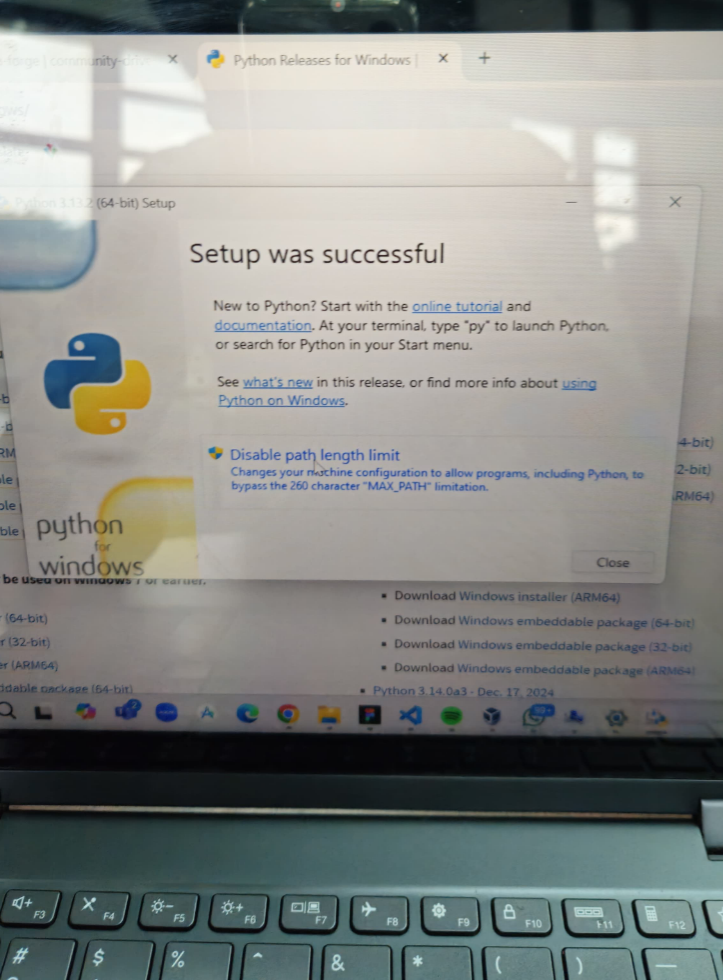

# PENGENALAN PYTHON
## 1. Pengertian PYTHON
Python adalah high-level programming language yang populer karena penulisan sintaks yang sederhana dan mudah dibuat dan dibaca. Python sering digunakan dalam pengembangan kecerdasan buatan (AI) dan ilmu data karena Python memiliki library yang banyak dan mudah digunakan untuk mendukung untuk pengolahan data dan pengembangan model pembelajaran mesin.  

[Dokumentasi Python bisa diklik disini](https://docs.python.org/3/tutorial/index.html)  

## 1.2 Installasi Python  
[Untuk Installasi Python macos bisa di klik disini](https://www.python.org/downloads/macos/)  
[Untuk Installasi Python Windows bisa di klik disini](https://www.python.org/downloads/windows/)  

#### Untuk Windows
Setelah Install dan selesai teman teman bisa klik file downloadnya lalu klik Install Now pada gambar dibawah ini dan jangan lupa klik add python.exe to path 
atau bisa custom install buat custom lokasi installasi
  
setelah selesai maka klik disable path agar tidak ada gangguan
  

#### untuk installasi mac os
1. Buka file .pkg yang telah diunduh.  
2. Ikuti petunjuk instalasi dengan menekan Continue hingga selesai.  
3. Setelah instalasi selesai, buka Terminal dan jalankan perintah berikut untuk mengecek versi Python:
```sh
python3 --version
```  
Jika sudah terinstal, akan muncul output seperti:
```sh
Python 3.x.x
```  

## 1.2.1 Installasi Vscode  
Vscode merupakan IDE yang popular karena sangat nyaman digunakan dan open source (gratis)  
Installasi VScode