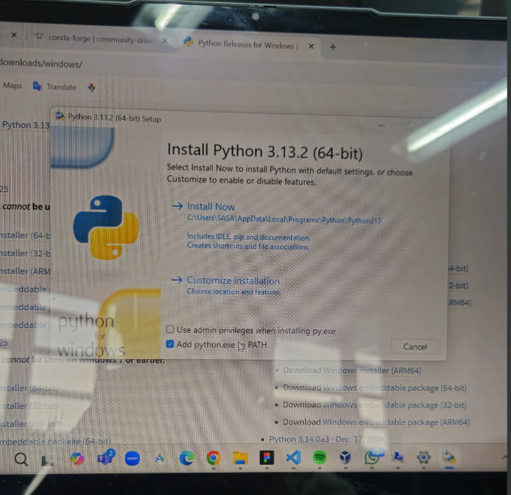

# PENGENALAN PYTHON
## 1. Pengertian PYTHON
Python adalah high-level programming language yang populer karena penulisan sintaks yang sederhana dan mudah dibuat dan dibaca. Python sering digunakan dalam pengembangan kecerdasan buatan (AI) dan ilmu data karena Python memiliki library yang banyak dan mudah digunakan untuk mendukung untuk pengolahan data dan pengembangan model pembelajaran mesin.  

[Dokumentasi Python bisa diklik disini](https://docs.python.org/3/tutorial/index.html)  

## 1.2 Installasi Python  
[Untuk Installasi Python macos bisa di klik disini](https://www.python.org/downloads/macos/)  
[Untuk Installasi Python Windows bisa di klik disini](https://www.python.org/downloads/windows/)  

Setelah Install dan selesai teman teman bisa klik file downloadnya lalu klik Install Now pada gambar dibawah ini  
